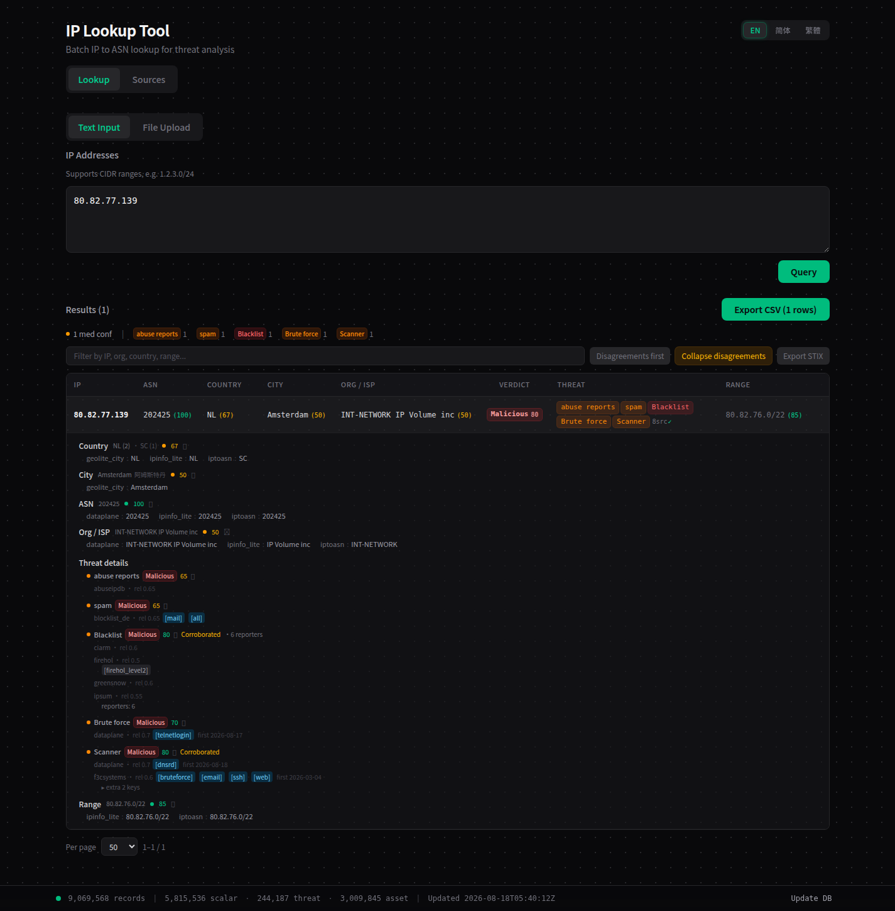
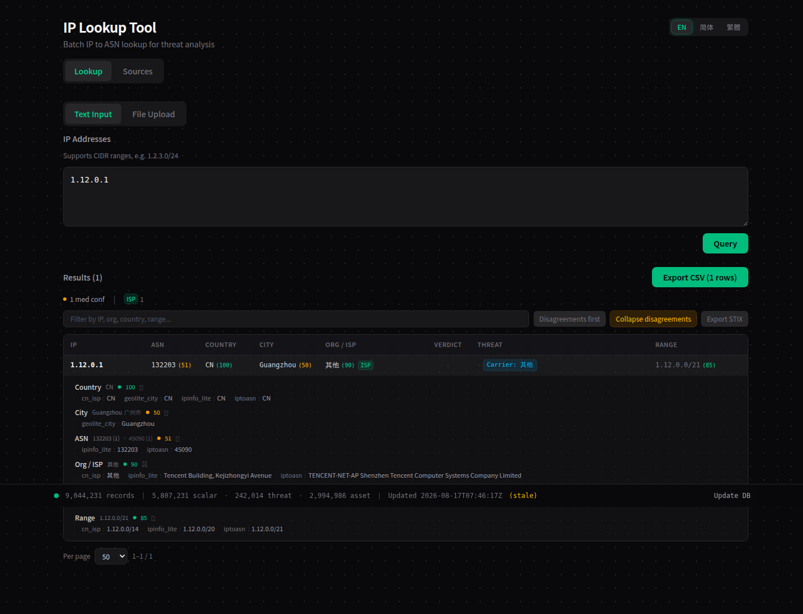
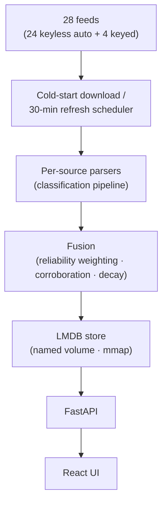

# IP Radar

把 28 个公开情报源搬回家：查任何 IP，拿一份说人话的裁决——证据、置信度、地理、ASN 一次看全。一条命令，自己部署。

> Pull 28 public threat feeds into your own box: every lookup comes back with a verdict in plain words — evidence, confidence, geo & ASN, all at once. One command, self-hosted.

[](LICENSE)




## 特性 | Features

- **开箱即用，24/28 源不要密钥** —— 首次启动自动下载构建，≈4.7M 条记录入库；剩下 4 个 🔑 源想开的话，密钥填法见[快速开始](#快速开始--quick-start)。
- **一份裁决，不是一堆列表** —— 单 IP 一句话结论，逐源证据摆给你看，0-100 置信度（源可靠性加权、交叉佐证、随时间衰减）。
- **地理 · 城市 · ASN** —— GeoLite2 给城市，iptoasn 给自治域，CN ISP 归属（含港澳台）也认得。
- **代理 · VPN · Tor · CDN，一眼认出来** —— 开放代理、VPN 网段、Tor 出口、三大 CDN 边缘，都标得清清楚楚。
- **一个容器跑全栈，内存自己看着办** —— `docker compose up -d --build` 就有；并发按宿主机内存自动收敛，默认每 30 分钟后台刷新。
- **STIX 2.1 导出（可选）** —— `/api/lookup/{ip}/stix` 一键导出；Docker 镜像默认不带 `stix2`，`pip install stix2` 装上即开。

> - **24 of 28 feeds need zero API keys** — first start downloads and builds them all into ≈4.7M records; to light up the other 4 🔑 sources, see [Quick Start](#快速开始--quick-start).
> - **A verdict, not a pile of lists** — one line of conclusion per IP, per-source evidence on the table, 0-100 confidence (reliability-weighted, corroborated, time-decayed).
> - **Geo · City · ASN** — GeoLite2 for the city, iptoasn for the ASN, plus CN ISP classification incl. HK/MO/TW.
> - **Proxy · VPN · Tor · CDN, spotted at a glance** — open proxies, VPN ranges, Tor exits, and the big three CDNs' edges, all labeled.
> - **One container, memory that behaves** — `docker compose up -d --build` and you're serving; concurrency bends to host RAM, background refresh every 30 min by default.
> - **STIX 2.1 export (optional)** — `/api/lookup/{ip}/stix`; the Docker image ships without `stix2` — `pip install stix2` to switch it on.



## 架构 | Architecture



融合、存储、查询，全在你本地——你的查询不发给任何第三方。

> Fused, stored, and queried on your own machine — your lookups never leave it.

## 快速开始 | Quick Start

### Docker（自托管推荐）

一个容器装下全部（FastAPI 后端 + 构建好的前端）。Docker Compose 要 v2.24+（`docker compose version` 看一眼）。

> The whole stack (FastAPI backend + built frontend) in one container. Docker Compose v2.24+ required (`docker compose version` to check).

```bash
git clone https://github.com/steponeerror/ip-radar.git
cd ip-radar
docker compose up -d --build
```

打开 http://127.0.0.1:8000 。首次启动会先把 24 个免密钥源（共 28 个：地理/城市/ASN 加主要封禁列表）下载构建完才开张——`docker compose logs -f` 盯进度；往后每次启动直接读 `ipradar-data` 卷，秒级。

> Open http://127.0.0.1:8000. First start downloads and builds all 24 keyless feeds (of 28: geo/city/ASN plus the major blocklists) before serving — watch with `docker compose logs -f`. Every later start reads straight from the `ipradar-data` volume, in seconds.

想开 4 个密钥源（ipinfo_lite / abuseipdb / otx / ip2proxy）或 ipapi.is 增强？把密钥写进 `.env.local`（已 gitignore，盖过 `.env`）：

> Want the 4 keyed sources (ipinfo_lite / abuseipdb / otx / ip2proxy) or ipapi.is enrichment? Drop the keys into `.env.local` (gitignored, overrides `.env`):

```bash
cp .env .env.local   # then open .env.local in any editor, fill keys; set IPAPI_IS_ENABLED=true if using ipapi.is
docker compose up -d
```

五个变量，去哪申请（`.env` 里也有同样的注释）：

> The five variables, and where to apply for keys (`.env` carries the same comments):

| 源 Source | 变量 Variable | 申请 Apply |
|---|---|---|
| ipinfo_lite | `IPINFO_TOKEN` | <https://ipinfo.io/account/token> |
| abuseipdb | `ABUSEIPDB_API_KEY` | <https://www.abuseipdb.com/account> |
| otx | `OTX_API_KEY` | <https://otx.alienvault.com/settings> |
| ip2proxy | `IP2PROXY_TOKEN` | <https://www.ip2location.com/> |
| ipapi.is（付费增强） | `IPAPI_IS_KEY` + `IPAPI_IS_ENABLED=true` | <https://ipapi.is/> |

npm/pip 下载慢（国内网络常见）——传镜像 build-args：

> Slow npm/pip downloads (common on CN networks) — pass mirror build-args:

```bash
docker compose build --build-arg PIP_INDEX_URL=https://pypi.tuna.tsinghua.edu.cn/simple \
                      --build-arg NPM_REGISTRY=https://registry.npmmirror.com
```

注意：

> Notes:

- 端口默认只绑 `127.0.0.1`；要上局域网/公网，改 `docker-compose.yml` 的 `ports`——注意本 API **没有任何鉴权**。
- 各源有自己的使用条款，商用责任自负（本仓库的 AGPL-3.0 只管代码）。
- 升级：`git pull && docker compose up -d --build`，数据卷原地保留。
- 磁盘：给数据卷留够 ≥6 GB。

> - The port binds to 127.0.0.1 by default; to go LAN/public, edit `ports` in `docker-compose.yml` — mind that the API has **no authentication**.
> - Each feed has its own usage terms; commercial use is your responsibility (this repo's AGPL-3.0 covers code only).
> - Upgrade: `git pull && docker compose up -d --build` — the data volume stays right where it is.
> - Disk: budget ≥6 GB for the data volume.

### 开发模式 | Development

**dev 模式**（前端 :5173 热更新，后端 API 走 :8000）：

> **Dev mode** (frontend hot-reload on :5173, backend API on :8000):

```bash
./dev.sh
```

**想分开跑也行：**

> **Or run each side yourself:**

```bash
# backend
cd backend && source .venv/bin/activate
uvicorn main:app --reload --host 0.0.0.0 --port 8000

# frontend
cd frontend && npm run dev
```

**类生产**（构建前端，一切都走 :8000）：

> **Production-style** (builds frontend, serves everything on :8000):

```bash
./start.sh
```

## 使用 | Usage

打开 http://127.0.0.1:8000 ，随手输一个 IP：裁决、逐源证据、地理/ASN 一起回来。API 也能直接用：

> Open http://127.0.0.1:8000 and type any IP: verdict, per-source evidence, and geo/ASN come back together. The API works directly too:

```bash
# 核心查询 | core lookup
curl -s http://127.0.0.1:8000/api/lookup/1.12.0.1
# → {"ip":"1.12.0.1","country":{"value":"CN",..},"city":{"value":"Guangzhou",..},"asn":{"value":132203,..},"classifications":{..},"attributes":{..}}

# 记录数与状态 | record count & status
curl -s http://127.0.0.1:8000/api/db-status

# 源装载清单 | loaded sources
curl -s http://127.0.0.1:8000/api/sources
```

其余管理端点（update-db / tasks / events 等）都在代码里；UI 上点一下也能触发刷新。

> The other management endpoints (update-db / tasks / events, …) live in the code; the UI triggers refreshes with one click too.

## 用 AI 扩展数据源 | Extending Sources with AI

仓库还自带三个 Claude Code skills（`.claude/skills/`）——装了 [Claude Code](https://claude.com/claude-code) 的话，一句话就能让 AI 替你把源加上：

> The repo also ships three Claude Code skills (`.claude/skills/`) — with [Claude Code](https://claude.com/claude-code) installed, one sentence lets AI wire the source in for you:

| Skill | 什么时候用 When | 一句话示例 Example |
|---|---|---|
| `discover-intel-sources` | 还没想好加哪个源，先要候选清单与评估 | “帮我找几个值得加的威胁情报源” |
| `add-intel-source` | 已选定某个源，要完整接入 | “把 GreyNoise 加进来” |
| `manage-intel-source` | 管理现有源：体检、更新、替换 | “看看各源的健康状况” |

- **discover-intel-sources** —— 没想好加什么？说说你的要求（免费/密钥、数据类型、覆盖面），它去调研，带回一份带评估的候选清单。
- **add-intel-source** —— 定了加谁就交给它：按仓库既有的接法一次到位——源文件、自动注册、分类映射、融合权重、回归测试。
- **manage-intel-source** —— 发现→接入→评估，整个生命周期都管：给现有源做体检，把低信号的换掉。

> - **discover-intel-sources** — not sure what to add? State your constraints (free/keyed, data type, coverage); it does the research and comes back with an evaluated shortlist.
> - **add-intel-source** — once you've picked one, hand it over: wired in one go under the repo's established pattern — source file, auto-registration, classification map, fusion weight, regression tests.
> - **manage-intel-source** — owns the whole discover→add→evaluate lifecycle: health-checks existing sources, swaps out the low-signal ones.

## 数据源与致谢 | Data Sources & Acknowledgments

下面每一份数据都属于它的提供方——感谢它们一直开放、一直维护。🔑 = 要免费/付费密钥（去哪填见[快速开始](#快速开始--quick-start)）；`*` = 聚合源，荣誉归于上游列表的维护者。

> Every dataset below belongs to its provider — thank you for keeping them open and maintained. 🔑 = needs a free/paid API key (where to put it: [Quick Start](#快速开始--quick-start)); `*` = aggregator, credit flows to the upstream list maintainers.

### 威胁信誉 | Threat Reputation

| 源 Source | 提供方 Provider | 贡献 Contributes | 🔑 |
|---|---|---|---|
| abuseipdb | [AbuseIPDB](https://www.abuseipdb.com/) | Most-reported attacker IPs | 🔑 |
| otx | [AlienVault OTX](https://otx.alienvault.com/) | Community threat pulses (IPv4 indicators) | 🔑 |
| spamhaus | [Spamhaus](https://www.spamhaus.org/drop/) | DROP/EDROP hijacked ranges | |
| stopforumspam | [StopForumSpam](https://www.stopforumspam.com/) | "Toxic" spam-only CIDR ranges | |
| threatfox | [abuse.ch](https://threatfox.abuse.ch/) | Malware IOC feed (CSV/ZIP) | |
| urlhaus | [abuse.ch](https://urlhaus.abuse.ch/) | Malicious URLs → IPs | |
| tweetfeed `*` | [TweetFeed](https://github.com/0xDanielLopez/TweetFeed) | Crowd-sourced IOCs from X/Twitter | |
| ipsum `*` | [IPsum](https://github.com/stamparm/ipsum) | Daily compile of many public blocklists | |
| firehol `*` | [FireHOL](https://github.com/firehol/blocklist-ipsets) | Aggregated blocklist levels | |
| blocklist_de `*` | [Blocklist.de](https://www.blocklist.de/) | 10 attack-type sublists + aggregate | |
| emerging_threats | [Proofpoint ET](https://rules.emergingthreats.net/) | Provenance-curated firewall blocklist | |
| binarydefense | [Binary Defense](https://www.binarydefense.com/banlist.txt) | Honeypot attacker banlist | |
| bruteforce | [BruteForceBlocker](http://danger.rulez.sk/) | SSH brute-force attacker IPs | |
| ciarm | [CINS Army](http://cinsscore.com/) | Passive-reputation bad-guys list | |
| greensnow | [GreenSnow](https://greensnow.co/) | Compromised-host blocklist | |
| dataplane | [Dataplane.org](https://dataplane.org/) | Rolling 7-day sensor signals (merged) | |
| f3csystems | [f3cSystems](https://github.com/f3cSystems/BlockList_IP) | Honeypot scanner blocklist (Sekoia sensors) | |
| reportedip | [ReportedIP](https://github.com/reportedip/reportedip-blacklist) | WordPress-honeypot community reputation | |

### 地理与 ASN | Geo & ASN

| 源 Source | 提供方 Provider | 贡献 Contributes | 🔑 |
|---|---|---|---|
| geolite_city | [MaxMind GeoLite2](https://github.com/P3TERX/GeoLite.mmdb) | City / geo per IP | |
| iptoasn | [IPtoASN](https://iptoasn.com/) | ASN + AS-name ranges | |
| cn_isp | [clang.cn ISP ranges](https://ispip.clang.cn/) | China ISP classification (mainland + HK/MO/TW) | |
| ipinfo_lite | [IPinfo](https://ipinfo.io/) | Country / ASN / ranges enrichment | 🔑 |

### 资产与网络面 | Asset & Network Surface

| 源 Source | 提供方 Provider | 贡献 Contributes | 🔑 |
|---|---|---|---|
| ip2proxy | [IP2Location](https://www.ip2location.com/) | PX2 LITE proxy ranges | 🔑 |
| proxyscrape | [ProxyScrape](https://github.com/proxyscrape/free-proxy-list) | Open proxy IPs | |
| tor_exits | [Tor Project](https://check.torproject.org/exit-addresses) | Tor exit node addresses | |
| x4bnet_vpn | [X4BNet](https://github.com/X4BNet/lists_vpn) | VPN ranges | |
| cdn_edges | AWS · Cloudflare · Fastly | CDN edge ranges | |
| infra_services | curated | Public DNS-root / NTP infrastructure | |

## 测试 | Tests

```bash
# backend (from backend/)
cd backend && python3 -m pytest -q

# frontend (from frontend/)
cd frontend && npm test
```

## 许可证 | License

AGPL-3.0，见 [LICENSE](LICENSE)；各情报源的使用条款各自保留。

> AGPL-3.0, see [LICENSE](LICENSE); each intelligence feed keeps its own terms.

## 关于这份代码 | About This Code

这个项目是 vibe coding 写出来的。它必然有这样那样的问题；请多包涵，也欢迎到 [Issues](https://github.com/steponeerror/ip-radar/issues) 告诉我哪里不对。

> This project was written by vibe coding. It surely has its quirks and rough edges; please be understanding, and file an [issue](https://github.com/steponeerror/ip-radar/issues) when you spot one.

## 后记 | Epilogue

上一家公司的工作经验，为本项目的开发提供了相当多的支持。某 TJ 威胁情报公司：工作氛围友好，强度也不高——只是欠了我大半年的工资，劳动仲裁之后，依然没有支付。

说实话，我对它并没有恨意，只是作为工作者立场不同。同时公司的处理方式并不正确

只是，我用正常账号访问公司的免费基础服务，你把我的号封了——这就有点离谱了吧。

本项目致力于维护劳动者的合法权益，同时保证人人都有基础的 IP 情报可用。

> Most of what went into this project, I owe to my previous employer — a certain TJ threat-intelligence company. The atmosphere was friendly, the pace was gentle; they simply owed me over half a year of wages, and after labor arbitration, still did not pay.
>
> To be honest, I hold no grudge against them — as a worker, we simply stand on different sides. That said, the way the company handled it was not right.
>
> And banning my account — a perfectly normal one, using nothing but their free basic services? That was a bit much.
>
> This project is dedicated to the legitimate rights of every worker — and to one simple belief: basic IP intelligence should be available to everyone.
